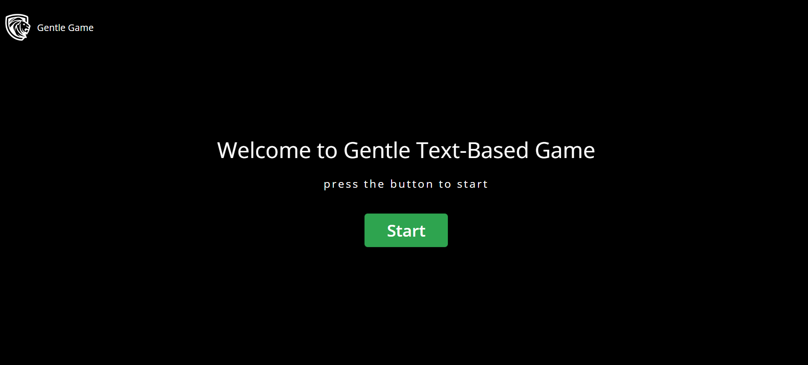
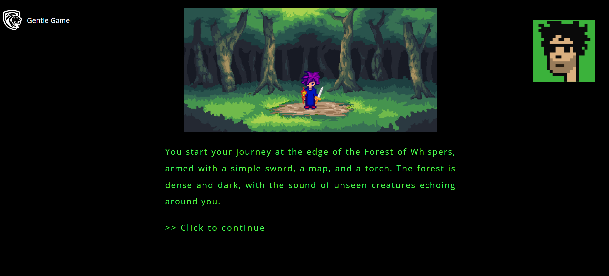
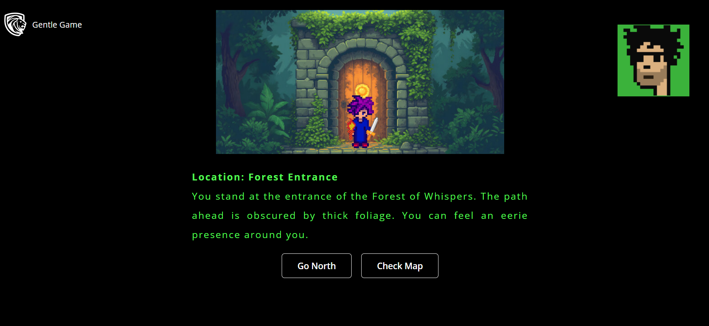

# Gentle Text-Based Game with F#

GentleGame is a text-based adventure game built using F# and WebSharper. The game allows players to explore the mystical land of Eldoria, where they seek a powerful amulet hidden deep within the Forest of Whispers. The game features various locations, choices, and paths that players can take to complete their quest.

## Sample Page

- This is the home page. press the 'Start' button to start the game.



- After click the button, you will see the Starter game page with some description.



- Sample of how Gentle Game look like.



## Technologies used

- [F#](https://fsharp.org)
- [WebSharper](https://websharper.com)
- [ASP.NET Core](https://dotnet.microsoft.com/en-us/apps/aspnet)

## Preview

You can see a live preview of the website [here](https://gentlegame.azurewebsites.net).

## Project Structure

- **Client.fs**: Entry point for the client-side code and Contains the logic for rendering pages and handling game state.
- **Startup.fs**: Server-side code
- **GameModel.fs**: Defines the game state, player state, and logic for updating the game state
- **wwwroot/index.html**: The main HTML file
- **wwwroot/Content/styles.css**: Styles for each web page.
- **wwwroot/Images**: Images used in the game.
- **GentleGame.fsproj**: Project file.

## Getting Started

To get a local copy up and running follow these simple steps.

### Prerequisites

Before you start, ensure you have the following installed:

- [.NET Core SDK](https://dotnet.microsoft.com/download)
- [Node.js](https://nodejs.org/)

### Installation

1. Clone the repo
   ```sh
   git clone https://github.com/Got17/Text-Based-Game.git
   ```
2. Navigate to the project directory
   ```sh
   cd Text-Based-Game
   ```
### Usage

1. Open the project in your favorite code editor.
2. Build the project using the following command:
   ```sh
   dotnet build
   ```
3. Run the project:
   ```sh
   dotnet run
   ```
4. Open your web browser and navigate to [http://localhost:5000](http://localhost:5000) to view the application.

## Contributing

Contributions are welcome! Please feel free to submit a pull request or open an issue.
